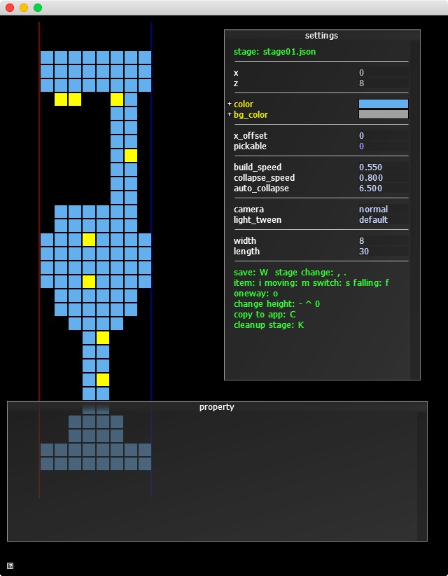

# BRICK&TRIPのステージエディタ
拙作アプリ[『BRICK&TRIP』](https://itunes.apple.com/us/app/brick-trip/id1051740912?l=ja&ls=1&mt=8)のステージエディタ

BRICK&TRIPでは、ステージデータ制作をすべてこのエディタでおこないました。

+ Cinderで用意されているダイアログを使ったユーザーインターフェース
+ ステージ編集はこのツールで完結しています

## How To Build
1. Cinderライブラリ(0.8.6)を[公式サイト](http://libcinder.org)からダウンロード。プロジェクトと同じ場所に置く
1. プロジェクトファイルを開く
1. Cinderライブラリへのパスを変更する
1. Let's enjoy!!

### 注意:Windows版
**VisualStudio2013** 必須。それ以外のバージョンではおそらくビルドできません。

## License
License All source code files are licensed under the MPLv2.0 license

[MPLv2.0](https://www.mozilla.org/MPL/2.0/)
